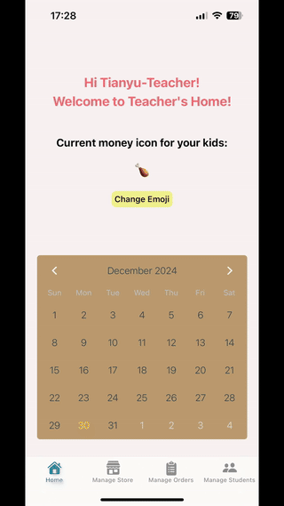

# Download

### [Kids Mini Shop on the App Store](https://apps.apple.com/us/app/kids-mini-shop/id6739957470)

# Important Notice:

### This app is only for certain after-schools for now. To try this app out as a guest, use the accounts below (or contact me via email (linastianbao@gmail.com) if you are interested in using it for your kids):
*Teacher* - *Account*: Tianyu-Teacher *Password*: shan123456

*Student* - *Account*: Harry-Student  *Password*: shan123456

# Demo

## -- Teacher Managing Shop --

### Tianyu is an encouraging teacher. He rewards his elementary school kids points for performing well. He decides to use Kid's Mini Shop to list gifts for the kids to buy with their points.

### Tianyu logs into his teacher-account. He finds out the default "points" icon is a star. He changes the icon to a chicken leg because his students love it.

### Now Tianyu is adding some lovely gift items into his shop. He carefully sets up the images, price, stock, description, and etc.

### He has students Harry and Dinner. He gives both of them 20 chicken legs for being good in the class and logs out. Wyatt is also a student, but he is not under Tianyu so Tianyu cannot reward him.

## -- Student Buying Items --

### Harry is teacher Tianyu's student. He logs into his student-account. He finds out he has 20 eggs and opens the store. He looks around and adds item of interest to his cart. Afterwards, he moves to his cart to checkout the item. Now the item is on the way ("On Delivery")!

### Dinner is also teacher Tianyu's student. He buys the item and follows the same procedure as Harry. Wyatt is not teacher Tianyu's student. Oops! It seems that his teacher hasn't given him any points or added any items to the store yet.

## -- Confirm the Purchase --

### Tianyu checks the orders. He already gave the item to Harry, so he confirms the delivery. Now, Harry won't be able to see his order because it is delivered. On the other hand, Dinner sees his order is still on the way ("On Delivery") and waits for his item to arrive.

